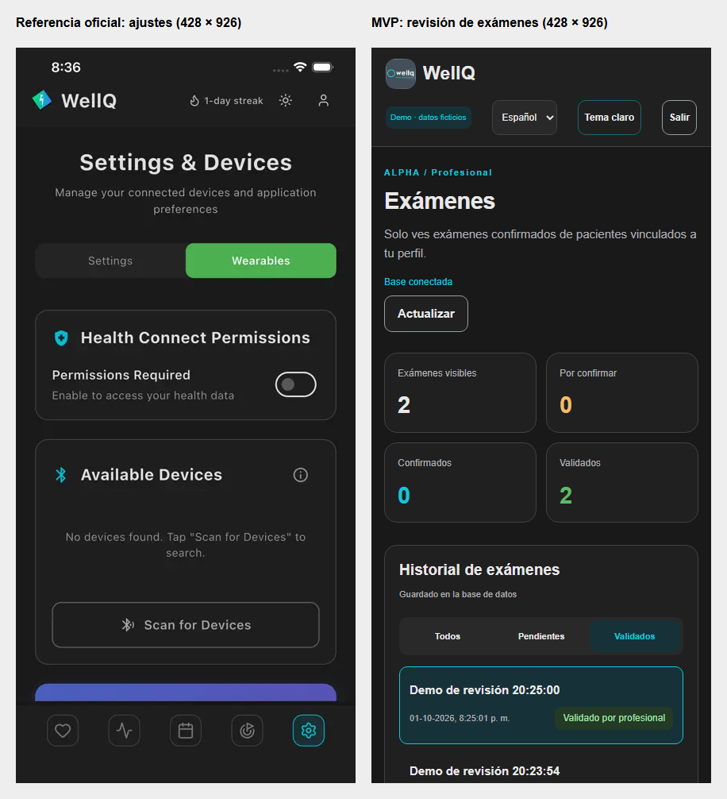

# Informe de avance — MVP WellQ, Fase 2

**Fecha:** jueves 1 de octubre de 2026. **Posible entrega:** sábado 3 de octubre.
**Autoría:** trabajo asistido por Codex a solicitud del usuario.
**Estado:** demo local probada; validación humana y aceptación académica pendientes.

## Qué se hizo

Se continuó desde la base D/E publicada, conservando el trabajo previo.
Se aplicó un subconjunto del documento `WellQ_Modelo_de_Datos.docx` a una
base MongoDB real y se construyó una interfaz para presentar el recorrido
completo de revisión de un examen ficticio.

| Parte | Resultado comprobado |
|---|---|
| Modelo de datos | patients, clinics, clinicians, cases y users; extensiones de exámenes, tenant, vínculos e historial documentadas |
| Persistencia | Los exámenes y las revisiones quedan guardados en MongoDB |
| Paciente | Crea un examen sintético, revisa/corrige valores y confirma o descarta |
| Profesional | Ve exámenes confirmados de pacientes vinculados; valida o rechaza |
| Separación de acceso | Alpha y Beta no comparten exámenes; pertenecer a la clínica no basta sin vínculo |
| Historial | Conserva propuesta original, correcciones, autor, fecha y acciones |
| Interfaz | Estilo oscuro/turquesa, tarjetas redondeadas, icono oficial, filtros, español/inglés y tema claro opcional |
| Ejecución | Arranque local Windows documentado, claves aleatorias fuera de Git |

El mapeo detallado, las decisiones y los límites técnicos están en
[modelo aplicado](MVP_MongoDB_Interfaz_2026-09-30.md). Se mantiene la prioridad
[DE → FG → ABC](arquitectura/PRIORIDADES_DE_FG_ABC.md).

## Referencia de diseño

El usuario indicó la [app real de WellQ](https://apps.apple.com/cl/app/wellq-app/id6755544981).
Se inspeccionaron sus capturas públicas y se adaptaron las superficies
oscuras, el cian, la jerarquía tipográfica y las tarjetas del módulo.
Los colores se infirieron visualmente; no se recibió un manual oficial.
La pantalla web sigue enfocada en exámenes y no simula funciones de la app
que este MVP no ofrece. El icono y las capturas pertenecen a WellQ y se
atribuyen como referencia del proyecto.

## Pruebas realizadas

- **37 pruebas automatizadas y 15 subpruebas aprobadas** con MongoDB real.
- Acceso, JWT vencido/manipulado, roles, funcionalidades y vínculos.
- Idempotencia y dos confirmaciones simultáneas con un único resultado válido.
- Propuesta original preservada, corrección y motivo, rechazo excluido.
- Persistencia entre instancias del API y bloqueo de bases no destinadas a demo.
- Recorrido de navegador: paciente registra, corrige 5 → 7, coteja identidad
  y baja confianza, confirma; profesional valida y comprueba elegibilidad.
- Filtros, español/inglés, claro/oscuro, logout y aislamiento Alpha/Beta.
- Vistas de 1365 px y móviles de 428/390 px sin desborde horizontal.
- **Cero errores de consola o excepciones JavaScript en el ensayo.**

La revisión visual encontró un problema de contraste durante el cambio
entre temas; se corrigió y se repitió el recorrido y la comparación.
[Resultados del navegador](evidencias-mvp-2026-10-01/browser-results.json).
[Informe de QA visual](<../Evidencias de sistema/Aplicación/wellq-base/design-qa.md>).

El script de arranque se revisó y pasó validación de sintaxis. Falta probar
su instalación completa desde cero en el equipo que se usará en la entrega.

## Cómo mostrarlo en cinco minutos

1. Abrir la demo y entrar como **Paciente · Clínica Alpha** con la clave local.
2. Crear un examen ficticio con confianza baja e identidad por revisar.
3. Corregir un valor, marcar los dos cotejos, explicar el motivo y confirmar.
4. Salir y entrar como **Profesional · Clínica Alpha**; abrir y validar el
   examen. Mostrar que el historial conserva las acciones y el valor original.
5. Entrar como **Beta** para demostrar que no ve el examen de Alpha.

[Instrucciones completas de arranque](<../Evidencias de sistema/Aplicación/wellq-base/README.md>).
Las capturas de login no contienen claves. El ensayo deja exámenes ficticios
identificados como demo para poder volver a mostrarlos.

## Límites y próximos pasos

La entrada es un formulario de datos ficticios: **todavía no carga ni extrae
PDF/imágenes y no calcula un puntaje médico**. La comprobación actual indica
si un marcador puede pasar a una futura etapa de cálculo. No se conecta a
la base real de WellQ, a OAuth real ni a servicios de IA.

Para el viernes 2: el equipo debe confirmar el alcance con la docente,
revisar el mapeo con el backend real y ensayar desde el equipo de exposición.
Para el sábado 3: presentar únicamente el recorrido comprobado y comunicar
los pendientes de extracción, catálogo y validación clínica. No se considera
completada toda la tabla A–G ni aprobados parámetros clínicos.

## Registro de entrega

- Base publicada anterior: `38830fa`, conservada en su rama y PR original.
- Primer incremento MongoDB: commit remoto `87b272d` (preparación local `ce91b8c`).
- Segundo incremento: adaptación visual, ensayo reproducible y estas evidencias;
  consultar el historial de Git para su hash definitivo.
- Rama de publicación: `feature/wellq-mvp-mongodb`.
- El avance se publica mediante commits nuevos; no se fuerza ni se sustituye
  el historial previo. Las claves, datos locales y documento original recibido
  quedan fuera del repositorio público.

Revisión y aprobación humanas pendientes. Este informe registra lo ejecutado;
no atribuye aprobación de empresa, docentes ni profesionales clínicos.
