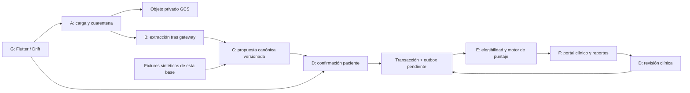

# Arquitectura de la base WellQ

Fecha: 2026-09-29. Alcance: módulo de exámenes del WellQ existente.

## Fuentes y precedencia

- Documento Maestro v1.0, §1.1–1.2, §3, §6–9: componentes, stack de
  referencia, doble puerta, esquema y puntaje.
- `Especificacion_Endpoints_Carga_Examenes_Medicos.docx` y
  `WellQ_Clinical_Test_Upload_API_Specification.docx`: contrato A existente.
- `BITACORA_ARQUITECTURA.md`, `BITACORA_STAKEHOLDERS.md` y
  `PLAN_FASES_COMPONENTES.md` en `37f909b`: decisiones y pendientes del equipo.
- PDF central y guía del proyecto ChatGPT: requisitos transversales;
  conservados fuera de este checkout como fuentes de solo lectura.
- Tabla e instrucción DE-FG-ABC adjuntas a la conversación del 29 de septiembre.

La propuesta NestJS/PostgreSQL de septiembre 5 es antecedente. El Documento
Maestro describe continuidad FastAPI/MongoDB/GCS, Flutter/Drift y portal
React. La base no reemplaza el stack de producción: implementa reglas puras
en Python, sin elegir servidor, ORM, hosting, proveedor de identidad ni DB.
ADR-006 sigue pendiente; no se declara que MongoDB tenga RLS ni que una
prueba unitaria equivalga a aislamiento en el motor.

## Límites de componentes

El diagrama describe el destino. En código existen únicamente las reglas
internas D, la compuerta E y una representación C reducida. A/B/F/G, GCS,
persistencia, outbox y worker aún no están implementados.

La prioridad de entrega DE-FG-ABC difiere del flujo de datos A→B→C→D→E→F.
Fixtures y contratos permiten avanzar D/E sin una carga ni extracción real.

## Reglas que no deben perderse

1. Primera puerta: el paciente confirma que la transcripción coincide con
   el documento. `confirmed` ya permite puntuar (§7.1). Segunda puerta:
   clínico con relación asistencial valida o rechaza. No exigir ambas para
   el primer cálculo; sí retirar datos rechazados del cálculo y las series.
2. Propuesta original inmutable. Correcciones generan una versión con
   autor, fecha y motivo; invalidan/recalculan snapshots dependientes.
3. El paciente no recibe puntaje ni interpretación (§1.2). F exige acceso
   clínico. Datos numéricos no confiables, unidades desconocidas y marcadores
   sin mapear se excluyen con motivo; no sustituir ausentes por cero.
4. Catálogo y fórmula se versionan separados del API. No inventar parámetros
   clínicos. La base retorna elegibilidad, **ningún puntaje 0–100**.
5. Reprocesar crea otra extracción y conserva historia. Job/confirmación
   con extraction_id o revisión antiguos falla sin modificar datos nuevos.

## Seguridad e integración a implementar

| Frontera | Regla de destino | Evidencia actual |
|---|---|---|
| Identidad | Validar JWT y membresía vigente; resolver paciente desde identidad | Contexto interno simulado; sin verificador JWT |
| Tenant | client_id desde servidor; repositorio siempre acotado; clinic_id mapeado explícitamente | Rechazo de contexto cruzado probado en funciones puras |
| Autorización | Permiso, feature y vínculo paciente comprobados por operación | Comprobaciones de dominio probadas; sin planes comerciales reales |
| Datos | Mongo: queries con tenant y claves/índices compuestos; PostgreSQL si se acuerda: RLS con rol limitado | Sin conexión ni esquema físico; ADR-006 abierto |
| Archivos | GCS privado, cuarentena, validación, URLs temporales autorizadas | Solo documentación A existente |
| Auditoría | Cinco dimensiones, sin valores clínicos en logs; append-only/outbox durable | Eventos de éxito retornados; sin persistencia ni inmutabilidad fuerte |
| Fallos | Denegaciones por canal durable fuera del rollback; no perder eventos al fallar el worker | Pendiente; excepciones solo contienen códigos |
| UI | Inglés inicial, i18n y variables de tema; no comunicar estado solo con color | Sin interfaz en esta entrega |

No usar `clinic_id` como sinónimo automático de tenant. Confirmar si una
organización puede contener varias clínicas y si un paciente tiene más de
un vínculo. El acceso de operador tampoco implica acceso a datos clínicos.

## Modelo lógico (sin migración física)

| Entidad | Identidad/relaciones | Contenido |
|---|---|---|
| clinical_test | (client_id, clinical_test_id), patient_id | Referencia al archivo; upload.status independiente de extraction.status |
| extraction | (client_id, extraction_id), clinical_test_id, revision | schema_version, proposal, confirmed, procedencia, estados y autores |
| marker_catalog | catalog_version + marker_code | Unidades, conversiones, rangos y pesos sujetos a aprobación clínica |
| score_snapshot | (client_id, snapshot_id), extraction_id + revision | scoring_version, catalog_version, contributions, excluded_markers, cobertura |
| audit_event | event_id + client_id | Quién, qué, cuándo, desde dónde, resultado y correlación |
| outbox | event_id/job_id + client_id | Trabajo durable y entrega idempotente |

Relaciones y consultas siempre incluyen tenant, también en jobs, índices,
exports y cachés. La versión mínima en Python no serializa el JSON v1 del
Maestro; es un recorte para reglas de dominio, documentado en prototype/.

## Contratos de integración que se preservan

Rutas del Maestro §7: `GET/PATCH /api/v1/clinical-tests/{clinical_test_id}/extraction`,
`POST .../extraction/reprocess`, `POST .../extraction/validate`. No están
servidas aún. A conserva sus 11 endpoints; no sustituir `initiate` por una
CRUD genérica. Adaptadores deben traducir DTO → dominio → respuesta.

PATCH debe persistir la clave idempotente con tenant, actor, ruta y hash de
entrada; misma clave/entrada retorna el resultado previo, otra entrada
produce conflicto. Transacción/CAS protege revisión y extraction_id. La
confirmación guarda evento y encola cálculo; no calcularlo sincrónicamente.

La demo no afirma cubrir esas garantías. Ver la matriz de prioridades y
`prototype/README.md` antes de ampliar su alcance.

## Git y verificación

Checkout inicial limpio: `main` 4a367cd; `develop` fb4db39 más antiguo;
rama de Vicente 37f909b descendiente de main. Se usa una rama nueva desde
37f909b para conservar sus cinco commits y todas las evidencias. No se
reescribe ninguna rama existente. Esa fue la base local de preparación.
La publicación del 30-09 se limita a Fase 2 y el workflow, sobre main:
no integra la rama documental de Vicente ni los cambios de las bitácoras
generales. Las referencias a esas bitácoras se consultan en la rama
`docs/bitacoras-y-evidencias-vicente`. El equipo revisa antes de integrar.

Pruebas locales: `python -m unittest discover -s tests -v` y demo sintética.
El workflow repite ambas en Python 3.12; su resultado remoto se verifica
por separado. No demuestra una BD operativa, despliegue ni validación clínica.
