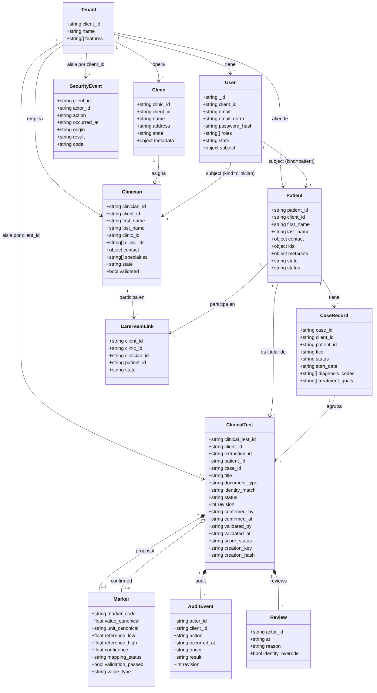
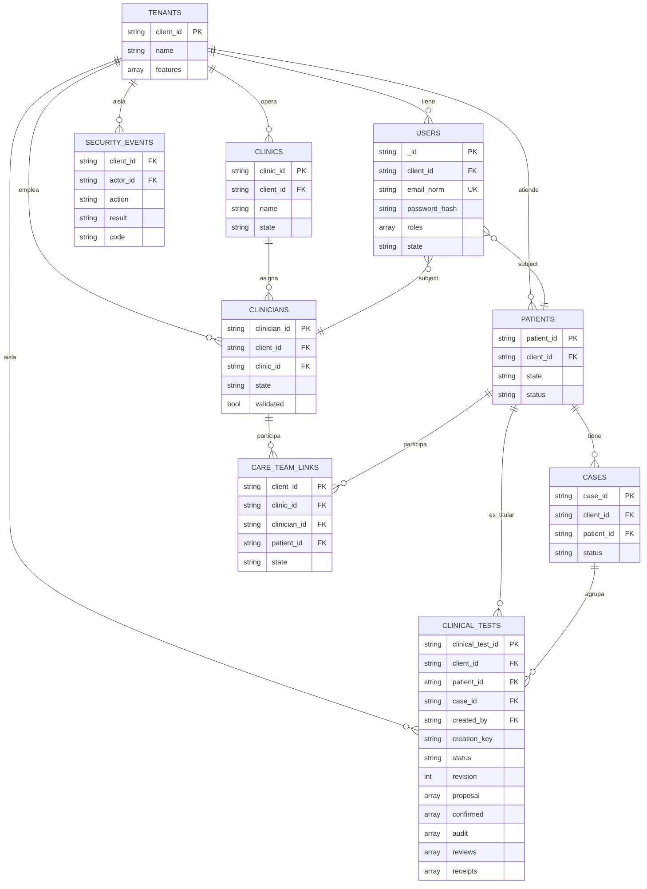

# Diagrama de clases y modelo de base de datos — MVP WellQ (MongoDB)

**Fase:** 2 — Requerimientos y diseño
**Fuente:** código real de la rama `feature/wellq-mvp-mongodb` (Sebastián González), archivos
`mvp/database.py` y `prototype/domain.py`, al 6 de octubre de 2026.
**Alcance:** igual que en `Diagramas_Casos_de_Uso_y_Actividad_MVP.md`, esto documenta lo que el
MVP ya implementa (9 colecciones de MongoDB, con sus validadores `$jsonSchema` e índices reales),
no un modelo aspiracional.

## 1. Diagrama de clases

Notas sobre el diagrama:
- `Marker`, `AuditEvent` y `Review` son **objetos embebidos** dentro de `ClinicalTest` (no
  colecciones propias de MongoDB) — se modelan como clases aparte porque tienen estructura e
  invariantes propias (ver validaciones de `Marker.__post_init__` en `prototype/domain.py`:
  rangos de referencia válidos, confianza entre 0 y 1, etc.).
- `User.subject` vincula un usuario de login con exactamente **un** `Patient` o **un**
  `Clinician` (nunca ambos) — el campo `subject.kind` define cuál. Esto es lo que permite
  `current_user()` en `mvp/app.py` derivar el rol real desde el token.
- `CareTeamLink` es la única entidad que conecta `Clinician` con `Patient`. **No existe ningún
  endpoint para crearla o modificarla** — ver `ST-027` en `BITACORA_STAKEHOLDERS.md`: hoy solo se
  crea sembrando datos a mano en `database.py:initialize()`. El diagrama la incluye porque existe
  como entidad de datos, pero ningún caso de uso del diagrama de casos de uso la gestiona, porque
  en el código no hay forma de gestionarla.

## 2. Modelo de base de datos (MongoDB)

| Colección | Clave primaria | Índices únicos reales | Aislamiento multi-tenant |
|---|---|---|---|
| `tenants` | `client_id` (`_id`) | — | es la raíz del tenant |
| `clinics` | `clinic_id` (`_id`) | `(client_id, clinic_id)` | `client_id` obligatorio (`$jsonSchema`) |
| `clinicians` | `clinician_id` (`_id`) | `(client_id, clinician_id)` | ídem |
| `patients` | `patient_id` (`_id`) | `(client_id, patient_id)` | ídem |
| `cases` | `case_id` (`_id`) | `(client_id, case_id)` | ídem |
| `users` | `_id` | `email_norm` (global), `(client_id, email_norm)` | ídem |
| `care_team_links` | `_id` | `(client_id, clinician_id, patient_id)` | ídem |
| `clinical_tests` | `clinical_test_id` (`_id`) | `(client_id, clinical_test_id)`, `(client_id, created_by, creation_key)` (idempotencia) | ídem + índice de consulta `(client_id, patient_id, created_at)` |
| `security_events` | `_id` | — | `client_id` obligatorio |

Puntos clave del aislamiento multi-tenant (requisito obligatorio del proyecto, verificado en
código real):
- **Todas** las colecciones exigen `client_id` vía `$jsonSchema` (`required: ['client_id']`),
  aplicado en MongoDB mismo, no solo en el backend.
- Cada consulta del API agrega `client_id` del contexto autenticado (`ctx.client_id`) a los
  filtros — no hay ninguna consulta en `mvp/app.py` que lea sin ese filtro.
- El seed de datos de demo (`database.py:initialize()`) crea **dos tenants separados**
  (`demo_alpha`, `demo_beta`) con un paciente deliberadamente **sin vincular** en `alpha`
  (`patient_alpha_unlinked`), pensado específicamente para probar que un clínico de `alpha` no
  puede acceder a un paciente sin `care_team_link` activo. Esto respalda directamente la prueba
  obligatoria del proyecto: *cliente A no puede acceder a datos del cliente B* (y, dentro del
  mismo cliente, un clínico no puede acceder a un paciente que no tiene asignado).

## 3. Pendiente / fuera de alcance de este MVP

- No hay colección ni modelo para administración de tenants/planes (Feature Gating hoy es un
  array fijo `features` sembrado a mano por tenant, no un panel de administración).
- No hay endpoint de alta de `care_team_links` (ST-027).
- El catálogo clínico para scoring (`score_eligibility`) no existe todavía — `eligibility`
  siempre responde `CLINICAL_CATALOG_PENDING`.
