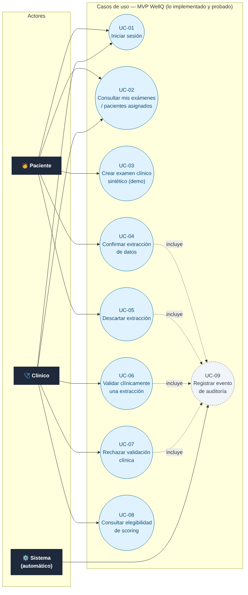
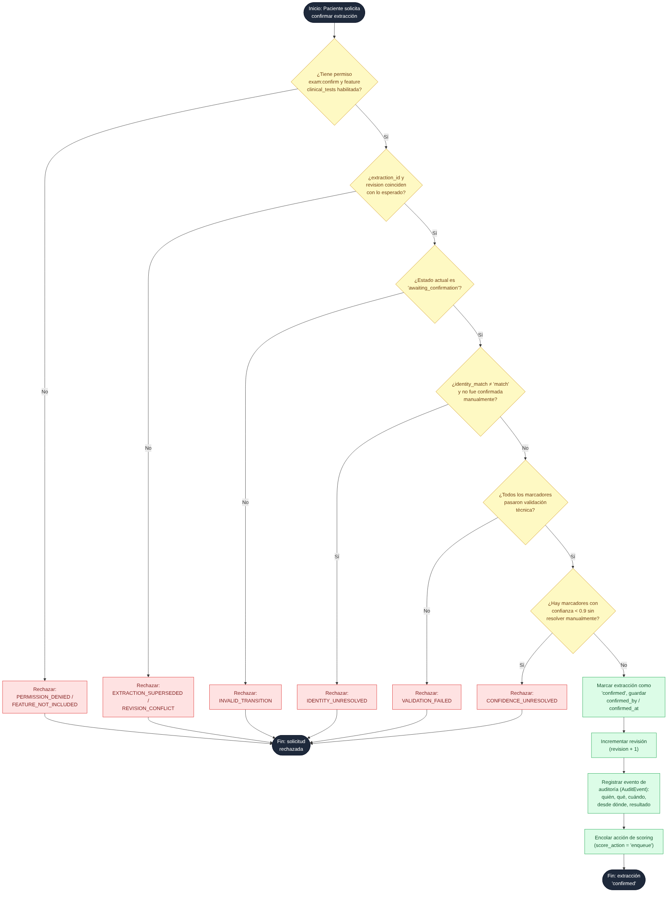
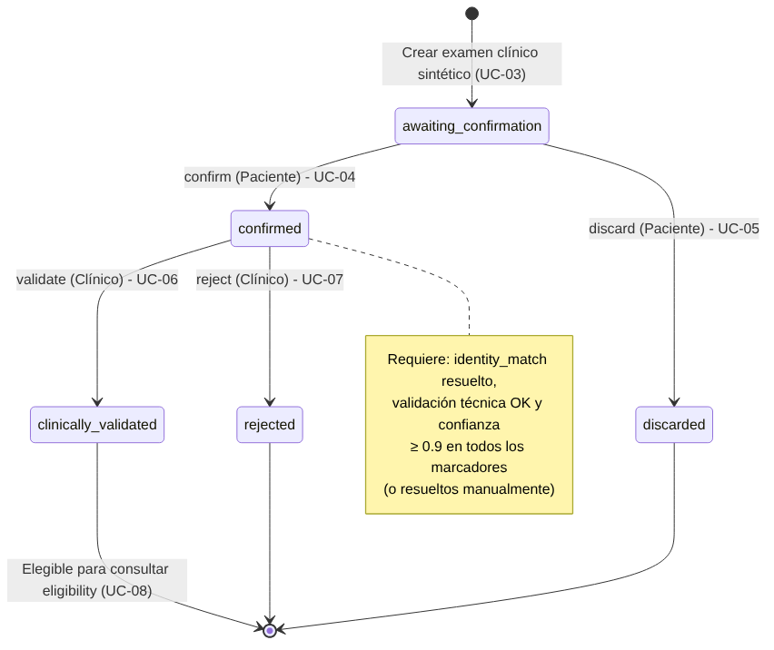

# Diagramas de casos de uso y de actividad — MVP WellQ (MongoDB)

**Fase:** 2 — Requerimientos y diseño
**Fuente:** código real de la rama `feature/wellq-mvp-mongodb` (Sebastián González), archivos
`mvp/app.py`, `mvp/security.py`, `mvp/models.py` y `prototype/domain.py`, al 6 de octubre de 2026.
**Alcance:** estos diagramas documentan **lo que el MVP ya implementa y prueba** (37+ pruebas
automatizadas en `tests/test_mvp.py`), no funcionalidades futuras ni la propuesta de pivote a
app móvil / prediagnóstico (`docs/reorientacion-movil-2026-10-03`), que sigue sin resolverse por
el equipo y por lo tanto no está reflejada aquí.

> Nota: el motor de scoring clínico real (`score_eligibility`) está deliberadamente sin
> implementar — el endpoint de elegibilidad siempre responde `CLINICAL_CATALOG_PENDING`. Esto es
> intencional según el propio código y se mantiene así hasta que exista un catálogo clínico
> aprobado (ver `BITACORA_STAKEHOLDERS.md`).

## 1. Diagrama de casos de uso

Dos roles de usuario implementados (`patient`, `clinician`, definidos en `mvp/security.py:PERMISSIONS`),
más el propio sistema, que registra auditoría de forma automática en cada acción sensible.

| ID | Caso de uso | Actor | Endpoint real |
|----|-------------|-------|----------------|
| UC-01 | Iniciar sesión | Paciente, Clínico | `POST /api/session` |
| UC-02 | Consultar mis exámenes / pacientes asignados | Paciente, Clínico | `GET /api/patients`, `GET /api/v1/clinical-tests` |
| UC-03 | Crear examen clínico sintético (demo) | Paciente | `POST /api/v1/demo/clinical-tests` |
| UC-04 | Confirmar extracción de datos | Paciente | `PATCH /api/v1/clinical-tests/{id}/extraction` (`action=confirm`) |
| UC-05 | Descartar extracción | Paciente | `PATCH .../extraction` (`action=discard`) |
| UC-06 | Validar clínicamente una extracción | Clínico | `PATCH .../extraction` (`action=validate`) |
| UC-07 | Rechazar validación clínica | Clínico | `PATCH .../extraction` (`action=reject`) |
| UC-08 | Consultar elegibilidad de scoring | Clínico (feature `lab_scoring`) | `GET .../eligibility` |
| UC-09 | Registrar evento de auditoría | Sistema (automático) | `AuditEvent` en cada transición |

Reglas de negocio visibles en el diagrama:
- El paciente solo puede actuar sobre **sus propios** exámenes (`patient_ids` calculado desde el
  token); el clínico solo sobre los pacientes de su `care_team_links` activo.
- `UC-08` depende de que el plan/tier del cliente incluya la feature `lab_scoring`
  (Feature Gating real, validado en backend vía `ctx.features`).
- Todas las transiciones de estado (UC-04 a UC-07) **incluyen obligatoriamente** UC-09: no existe
  código que modifique un examen sin dejar un `AuditEvent` (quién, qué, cuándo, desde dónde, resultado).

## 2. Diagrama de actividad — Confirmar extracción (UC-04)

Se eligió este caso de uso porque concentra la mayor parte de las reglas de negocio ya
implementadas y probadas (`prototype/domain.py: transition()`), y porque es el flujo más
representativo de cómo el sistema combina RBAC, Multi-Tenancy y auditoría en una sola operación.

Cada rechazo corresponde a un código de error real devuelto por la API (no descriptivo
inventado): `PERMISSION_DENIED`, `FEATURE_NOT_INCLUDED`, `EXTRACTION_SUPERSEDED`,
`REVISION_CONFLICT`, `INVALID_TRANSITION`, `IDENTITY_UNRESOLVED`, `VALIDATION_FAILED`,
`CONFIDENCE_UNRESOLVED`.

## 3. Diagrama de estados (complementario) — ciclo de vida de una extracción

No reemplaza al diagrama de actividad exigido por la pauta; se incluye como material de apoyo
para el modelo de datos y la documentación de arquitectura, porque deja más clara la máquina de
estados completa de un examen clínico (los cuatro estados terminales posibles).

## 4. Trazabilidad

- Código fuente revisado: rama `feature/wellq-mvp-mongodb`, commit vigente al 6-oct-2026.
- Diagramas generados a partir de descripciones Mermaid versionadas junto a este documento
  (`casos_de_uso.mmd`, `actividad_confirmar.mmd`, `estados_extraccion.mmd`), para que puedan
  regenerarse o editarse si el código cambia.
- Pendiente de incorporar cuando exista: caso de uso de administración de tenants/usuarios
  (todavía no implementado en el MVP — ver `BITACORA_PROGRESO.md`) y cualquier caso de uso que
  surja si el equipo aprueba el pivote a app móvil.
